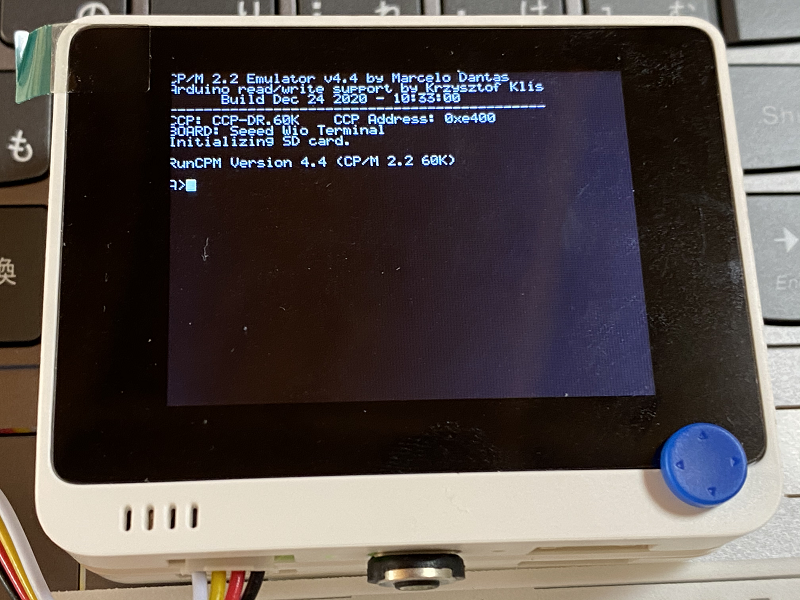
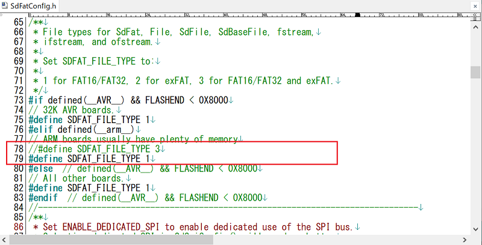
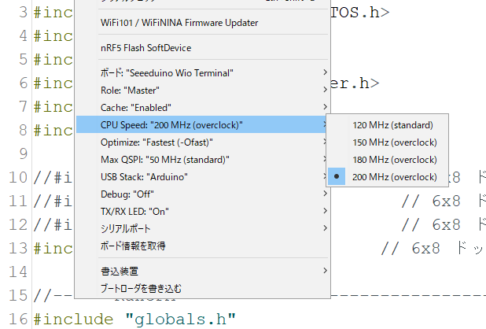

# Wio_RunPCM_vt100_CardKB
Wio Terminalで動く超小型CP/Mマシン

  
  

"VT100 Terminal Emulator"と"Z80 CP/M 2.2 emulator"を組み合わせた、Wio Terminalで動く超小型CP/Mマシンです。 
(注意：ディスプレイが1行53文字なので、1行80文字を前提にしているプログラムは表示が崩れます。)  
ベースにしたオリジナルはこちら。 
VT100 Terminal Emulator for Arduino STM32 <https://github.com/ht-deko/vt100_stm32> 
RunCPM - Z80 CP/M 2.2 emulator <https://github.com/MockbaTheBorg/RunCPM> 

---

### 必要な物 ###
* [Wio Terminal](https://www.switch-science.com/catalog/6360/ "Title") 
* Arduino IDE (1.8.13で動作確認をしました。) 
* [SAMD51 Interrupt Timer library](https://github.com/Dennis-van-Gils/SAMD51_InterruptTimer "Title")
* [SDdFatライブラリ](https://github.com/greiman/SdFat "Title") (2.0.4で動作確認をしました。)
* [LovyanGFXライブラリ](https://github.com/lovyan03/LovyanGFX "Title")
* [M5Stack用カード型キーボードユニット](https://www.switch-science.com/catalog/5689/ "Title")
* microSD カード
 

ライブラリはArduino IDEの[スケッチ | ライブラリをインクルード |ライブラリを管理...] からインストールすると簡単です。

---
### SDdFatライブラリの修正 ###
2.0.x では SdFatConfig.h に以下の修正が必要です。 
ファイルは"ドキュメント\Arduino\libraries\SdFat\src"に有ります。

  

---
### 補足 ###
CPU Speed を "200MHz" にして、Optimize を "Fastest" にすると描画速度が向上します。 
ただし、バッテリーの消耗は早まるかもしれません。

  

---

ビルド済みファイルを用意してあるので、すぐに試すことができます。 
RunCPM 用のディスク (microSD) は別途用意する必要があります(参考資料を参照)。 
### 手順 ###
1. Wio TerminalとPCをUSBケーブルで接続します。
2. Wio Terminalをダブルリセット(リセットを素早く2回やる)してブートローダーモードに入ります。
3. USB接続しているPCにドライブが表示されます。
4. このドライブにUF2フォルダ内のファイルをコピーします。 
(CPU Speed"200MHz"版も入っています。)

---

### CardKBでの制御文字の入力方法 ###

* Ctrl-@: Fn-2
* Ctrl-A～Z : Fn-a～z
* Ctrl-\[: Fn-9
* Ctrl-\\: Fn-7
* Ctrl-\]: Fn-0
* Ctrl-^: Fn-6
* Ctrl-_: Fn-8

---

### 参考資料 ###
RunCPM用のディスクの作り方などは、DEKO（@ht_deko）さんのこちらの記事を参照してください。 

* [RunCPM (Z80 CP/M 2.2 エミュレータ)](https://ht-deko.com/arduino/runcpm.html "Title")   

